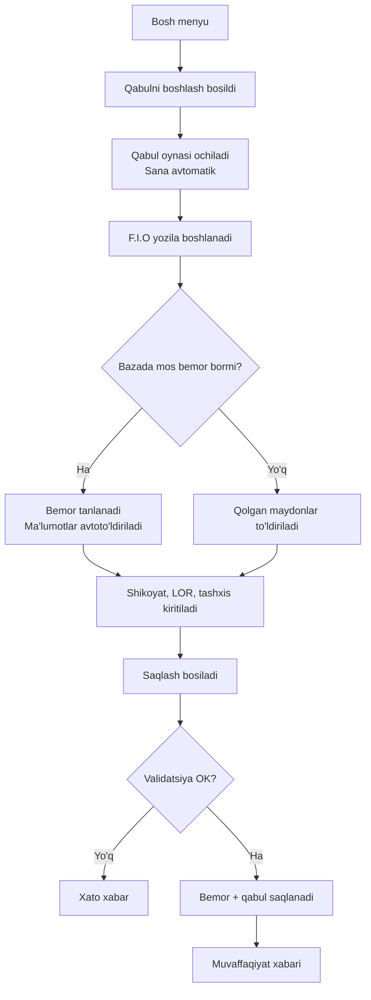

# 📋 Texnik Topshiriq (SPEC) — Clinic LOR Desktop

> **Versiya:** 1.0
> **Sana:** 2026-07-12
> **Holat:** Logika bosqichi — kod yozilmagan
> **Til:** O'zbekcha (interfeys uz/ru)

---

## 1. Loyiha haqida

### 1.1 Umumiy tavsif

**Clinic LOR Desktop** — LOR (otorinolaringologiya) shifokorlari va klinika administratorlari uchun mo'ljallangan **oflayn desktop dastur**.

Dastur bemor qabul qilish, ko'rikni qayd etish, to'lovlarni boshqarish va statistika olish kabi kundalik klinika ish jarayonlarini avtomatlashtiradi.

### 1.2 Maqsadi

- Qog'ozdagi tibbiy kartalarni raqamli formatga o'tkazish
- LOR ko'rigini strukturaviy va tez qayd etish (checkbox orqali)
- Bemor tarixini oson qidirish va tahlil qilish
- To'lovlarni shaffof hisoblash
- Ish jarayonini **50% ga tezlashtirish** (qo'lda yozishga solishtirganda)

### 1.3 Muhit

- **Platforma:** Windows 10/11 (asosiy), Linux, macOS
- **Internet:** talab qilinmaydi (oflayn)
- **Ish rejimi:** bitta kompyuter — bitta klinika (birinchi versiya)
- **Foydalanuvchilar soni:** 1-3 xodim (parolsiz)

---

## 2. Foydalanuvchi rollari

Birinchi versiyada **rol/parol tizimi yo'q** — dastur bitta kompyuterda ishlaydi va jismonan himoyalangan deb faraz qilinadi.

| Rol | Ish tavsifi |
|-----|-------------|
| **Shifokor (LOR)** | Bemor qabul qilish, shikoyat, LOR STATUS, tashxis, tavsiya kiritish. Chop etish. |
| **Administrator** | Bemor tarixini yuritish, kassa yozuvlari, statistika, xizmatlar va shifokorlar ma'lumotini boshqarish. |

Kelajakda (v2+) login/parol qo'shilishi mumkin.

---

## 3. Texnologiyalar

| Komponent | Texnologiya | Sabab |
|-----------|-------------|-------|
| **Dasturlash tili** | Python 3.11+ | Boy kutubxonalar, tez rivojlantirish |
| **GUI** | PySide6 (Qt 6) | Zamonaviy, cross-platform, professional |
| **Ma'lumotlar bazasi** | SQLite | Server kerak emas, bitta fayl, ishonchli |
| **ORM** | SQLAlchemy 2.0 | Kuchli, keng qo'llaniladi |
| **Migratsiya** | Alembic | Sxema o'zgarishlarini boshqarish |
| **Word yaratish** | python-docx + docxtpl | Shablonli yaratish (`{{placeholder}}`) |
| **Word→PDF (ixtiyoriy)** | LibreOffice CLI yoki `docx2pdf` | Faqat kerak bo'lganda |
| **Diagramma** | matplotlib | Statistika grafiklari |
| **Paketlash** | PyInstaller | Bitta `.exe` fayl |
| **Testlar** | pytest | Biznes-logikani sinash |
| **Loglash** | loguru | Sodda va chiroyli log'lar |

Batafsil: [`docs/architecture.md`](docs/architecture.md)

---

## 4. Ekranlar (screens)

### 4.1 Til tanlash oynasi

**Qachon ko'rinadi:** faqat birinchi ishga tushirilganda.

```
┌─────────────────────────────────┐
│      🏥 Klinika dasturi         │
│                                 │
│      Tilni tanlang / Выберите   │
│                                 │
│   ┌───────────┐  ┌───────────┐ │
│   │ O'ZBEKCHA │  │  РУССКИЙ  │ │
│   └───────────┘  └───────────┘ │
└─────────────────────────────────┘
```

- Tanlangan til `settings.language` maydoniga yoziladi
- Keyingi ishga tushirishlarda darhol bosh menyu ochiladi

### 4.2 Bosh menyu

```
┌─────────────────────────────────────────────┐
│  🏥 [Klinika nomi]              [🌍 UZ|RU] │
├─────────────────────────────────────────────┤
│                                             │
│     ┌───────────────────────────────┐      │
│     │  🩺 QABULNI BOSHLASH          │      │
│     └───────────────────────────────┘      │
│                                             │
│     ┌───────────────────────────────┐      │
│     │  📋 BEMORLAR TARIXI           │      │
│     └───────────────────────────────┘      │
│                                             │
│     ┌───────────────────────────────┐      │
│     │  💰 KASSA                      │      │
│     └───────────────────────────────┘      │
│                                             │
│     ⚙️ Sozlamalar         ❓ Yordam        │
└─────────────────────────────────────────────┘
```

**Elementlar:**
- Yuqori chap: klinika nomi (sozlamalardan)
- Yuqori o'ng: til almashtirgich (UZ / RU)
- Markazda: 3 ta katta tugma
- Pastda: sozlamalar va yordam
- Chiqish: `X` tugmasi (yopishdan oldin tasdiqlash)

### 4.3 Qabulni boshlash oynasi

**Bo'limlar:**

#### 4.3.1 Yuqori panel
- **Qabul sanasi va vaqti** — avtomatik hozirgi (tahrirlash mumkin)
- **Orqaga** tugmasi (o'zgarishlar saqlanmagan bo'lsa ogohlantirish)

#### 4.3.2 Bemor ma'lumotlari
| Maydon | Turi | Majburiy | Izoh |
|--------|------|----------|------|
| F.I.O | Matn | ✅ | Kamida 5 belgi. Yozganda avtomatik bazadan qidiradi |
| Tug'ilgan yili | Raqam | ✅ | 1900–joriy yil |
| Manzil | Matn | ⬜ | Erkin matn |
| Telefon | Matn | ⬜ | Format: `+998 XX XXX XX XX` |

**Avtoto'ldirish logikasi:**
- Foydalanuvchi F.I.O yoza boshlaganda (kamida 2 belgi) dropdown chiqadi
- Dropdown'da mos bemorlar: `Aliyev Ali (1990) — Toshkent`
- Bemor tanlansa — barcha maydonlar avtomatik to'ldiriladi
- Tug'ilgan yili ham bir xil bo'lsa — bu **aynan o'sha bemor**, aks holda **yangi bemor** yaratiladi

#### 4.3.3 Shikoyatlar bo'limi

**Strukturaviy (checkbox orqali) + erkin matn:**

```
┌─── SHIKOYATLAR ─────────────────────────────┐
│                                              │
│  ▼ 👂 QULOQ                                 │
│    ☐ Quloq suprasida kosmetik nuqson        │
│    ☐ Quloqda og'riq                         │
│    ☐ Quloqdan ajralma kelishi               │
│       └─ Turi: [Yiringli ▼]                 │
│    ...                                       │
│                                              │
│  ▶ 👃 BURUN VA YONDOSH BURUN BO'SHLIQLARI   │
│  ▶ 😮 HALQUM                                 │
│  ▶ 🗣 HIQILDOQ                              │
│                                              │
│  ── Qo'shimcha shikoyatlar ──               │
│  [__________________________________]        │
│                                              │
│  Tanlangan: 3 ta   [🗑 Tozalash]           │
└──────────────────────────────────────────────┘
```

**Qoidalar:**
- ✅ **Kamida 1 ta shikoyat tanlanishi shart** (checkbox yoki qo'shimcha matn)
- ✅ "Ajralma" tanlanganda **tur** dropdown ochiladi (yiringli, seroz, shilliq, qonli...)
- ✅ Bo'limlar buklanuvchi (accordion)
- ✅ Har bir bo'limda tanlangan sanoq ko'rinadi

**To'liq katalog:** [`docs/complaints_catalog.md`](docs/complaints_catalog.md)

#### 4.3.4 Anamnez
- Ixtiyoriy erkin matn (2-3 qatorli)

#### 4.3.5 LOR STATUS

**4 tab: Rinoskopiya / Faringoskopiya / Otoskopiya / Laringoskopiya**

Har bir tab'da o'zining bo'limlari va tanlanadigan elementlari bor.

**Qoidalar:**
- ⬜ **Majburiy emas** — bo'sh saqlash mumkin
- ✅ **"Norma" tugmasi** — barcha bo'limlarni normal holatga o'tkazadi
- ✅ **Preview** — pastda real vaqtda matn ko'rinadi
- ✅ **Otoskopiya**: AD (o'ng) va AS (chap) alohida ustunlarda

**To'liq katalog:** [`docs/lor_status_catalog.md`](docs/lor_status_catalog.md)

#### 4.3.6 Tashxis
- Majburiy matn maydoni
- Kelajakda ICD-10 dan tanlash qo'shilishi mumkin

#### 4.3.7 Tavsiya
- Erkin matn, ixtiyoriy
- Preparat/protsedura tavsiyalari

#### 4.3.8 Shifokor va telefon
- **Shifokor:** dropdown (sozlamalardan)
- **Telefon:** shifokor tanlanganda avtomatik chiqadi (o'zgartirish mumkin)

#### 4.3.9 Pastki tugmalar

| Tugma | Xatti-harakat |
|-------|---------------|
| 💾 **Saqlash** | Validatsiya → bemor+qabulni bazaga yozish → muvaffaqiyat xabari → oynani yopish (yoki formani tozalash) |
| 🖨 **Chop etish** | Avval saqlash → Word hujjatini yaratish (shablon asosida) → oldindan ko'rish → printerga |
| 💰 **Kassa** | Avval saqlash → kassa oynasini shu bemor+qabul uchun ochish |

**Validatsiya qoidalari:**

| Maydon | Tekshiruv |
|--------|-----------|
| F.I.O | Kamida 5 belgi, faqat harflar va bo'sh joy |
| Tug'ilgan yili | 1900 dan joriy yilgacha |
| Telefon | Bo'sh yoki `+` bilan 12 belgi |
| Shikoyatlar | Kamida 1 ta checkbox yoki qo'shimcha matn |
| Tashxis | Bo'sh bo'lmasin, kamida 3 belgi |
| Shifokor | Tanlangan bo'lsin |

### 4.4 Bemorlar tarixi

```
┌───────────────────────────────────────────────────────┐
│  ← Orqaga    BEMORLAR TARIXI       [📊 Statistika]   │
├───────────────────────────────────────────────────────┤
│  🔍 Qidiruv: [_______]  [F.I.O ▼]  [🗑 Tozalash]    │
│  Sana: [dan] — [gacha]   [🔎 Filter]                 │
├───────────────────────────────────────────────────────┤
│  # │ F.I.O          │ Yosh │ Oxirgi qabul │ Amal    │
│  1 │ Aliyev Ali     │ 34   │ 12.07.2026   │👁 ✏ 🗑  │
│  2 │ Karimova Z.    │ 28   │ 11.07.2026   │👁 ✏ 🗑  │
│  ...                                                  │
├───────────────────────────────────────────────────────┤
│  Jami: 42 bemor           [◀  1  2  3  ▶]           │
└───────────────────────────────────────────────────────┘
```

**Funksiyalar:**
- **Qidiruv turi:** F.I.O, telefon, tashxis, tug'ilgan yili
- **Sana filtri:** dan-gacha (qabul sanasi bo'yicha)
- **Sahifalash:** 20 tadan
- **Ko'rish** (👁): bemor kartochkasi (barcha qabullar + to'lovlar tarixi)
- **Tahrirlash** (✏): oxirgi qabulni tahrirlash oynasi
- **O'chirish** (🗑): tasdiqlash bilan, kaskadli o'chirish

**Bemor kartochkasi (👁):**

```
┌──────────────────────────────────────────────┐
│  Aliyev Ali — 34 yosh (1990)                 │
│  📞 +998 90 123 45 67                        │
│  📍 Toshkent sh., Yunusobod                  │
├──────────────────────────────────────────────┤
│  Qabullar tarixi:                            │
│  ─ 12.07.2026 — Otit media (Dr. Karimov)     │
│                              [🖨] [✏] [🗑]  │
│  ─ 05.03.2026 — Tonzillit                    │
│  ─ 14.11.2025 — Rinit                        │
├──────────────────────────────────────────────┤
│  To'lovlar:                    Jami: 450 000 │
│  ─ 12.07.2026 — Konsult. — 100 000           │
│  ─ 05.03.2026 — Konsult. + Kompress — 150K   │
└──────────────────────────────────────────────┘
```

### 4.5 Statistika (bemorlar tarixi ichida)

```
┌─────────────────────────────────────────────┐
│  📊 STATISTIKA                              │
├─────────────────────────────────────────────┤
│  Davr:                                      │
│   ○ Bugun  ○ Hafta  ● Oy  ○ Yil            │
│   ○ Boshqa: [___] — [___]                   │
├─────────────────────────────────────────────┤
│  👥 Jami bemorlar:            42            │
│  🆕 Yangi bemorlar:           12            │
│  🔁 Takroriy qabullar:        30            │
│                                             │
│  🩺 TOP tashxislar:                         │
│     1. Otit media — 15                      │
│     2. Tonzillit — 10                       │
│     3. Rinit — 8                            │
│                                             │
│  📈 [Grafik: kunlar bo'yicha qabullar]     │
├─────────────────────────────────────────────┤
│  [📄 Word'ga eksport]                       │
└─────────────────────────────────────────────┘
```

**Hisoblash:**
- **Jami bemorlar** = tanlangan davrda **noyob bemor** soni
- **Yangi bemorlar** = tanlangan davrda **birinchi marta** kelganlar
- **Takroriy qabullar** = jami qabullar − yangi bemorlar
- **TOP tashxislar** = SQL `GROUP BY diagnosis ORDER BY COUNT DESC`

**Davr variantlari:**
- **Bugun:** [bugun 00:00, bugun 23:59]
- **Hafta:** [dushanba 00:00, yakshanba 23:59]
- **Oy:** [oyning 1-kuni, oxirgi kuni]
- **Yil:** [1 yanvar, 31 dekabr]
- **Boshqa:** ikkita sana

### 4.6 Kassa oynasi

```
┌─────────────────────────────────────────────────┐
│  ← Orqaga    KASSA       [📊 Statistika]       │
├─────────────────────────────────────────────────┤
│  Bemor:  [🔍 F.I.O tanlash]                    │
│  Qabul:  [Bugungi qabul ▼]  (ixtiyoriy)        │
├─────────────────────────────────────────────────┤
│  ┌── Xizmatlar ───────────────────────────┐   │
│  │ [+ Xizmat qo'shish]                     │   │
│  │ ────────────────────────────────────── │   │
│  │ # │ Xizmat        │ Soni │ Narx  │Jami │   │
│  │ 1 │ Konsultatsiya │ [1]  │100 000│100K │🗑│
│  │ 2 │ Audiometriya  │ [1]  │150 000│150K │🗑│
│  │ 3 │ Kompress      │ [2]  │50 000 │100K │🗑│
│  └────────────────────────────────────────┘   │
│                                                 │
│  JAMI:                          350 000 so'm  │
│                                                 │
│  Izoh: [_____________________]                  │
├─────────────────────────────────────────────────┤
│  [💾 To'lovni saqlash]  [🖨 Kvitansiya]        │
└─────────────────────────────────────────────────┘
```

**Qoidalar:**
- ✅ **Bemor tanlanishi shart**
- ⬜ **Qabul tanlanishi ixtiyoriy** (qabulsiz to'lov ham mumkin — masalan, faqat protsedura)
- ✅ Soni o'zgartirilganda — JAMI avtomatik qayta hisoblanadi
- ✅ Xizmat narxi bazadagi joriy narx (lekin yozuvda `price_at_moment` sifatida saqlanadi — keyin o'zgarmaydi)
- ✅ Kamida 1 ta xizmat qo'shilishi shart

### 4.7 Kassa statistikasi

```
┌────────────────────────────────────────┐
│  📊 KASSA STATISTIKASI                 │
├────────────────────────────────────────┤
│  Davr: [Bugun ▼]                       │
├────────────────────────────────────────┤
│  💰 Jami tushum:      5 250 000 so'm  │
│  📊 To'lovlar soni:   42               │
│  💵 O'rtacha chek:    125 000 so'm    │
│                                        │
│  Xizmatlar bo'yicha:                   │
│   ─ Konsultatsiya: 40 × 100K = 4M     │
│   ─ Audiometriya:  5 × 150K  = 750K   │
│   ─ Kompress:      10 × 50K  = 500K   │
│                                        │
│  📈 [Grafik: kunlik tushum]           │
├────────────────────────────────────────┤
│  [📄 Word'ga eksport]                  │
└────────────────────────────────────────┘
```

### 4.8 Sozlamalar oynasi

**4 tab:**

#### Tab 1: Klinika ma'lumotlari
- Klinika nomi (uz/ru)
- Manzil (uz/ru)
- Telefon
- Logo (rasm yuklash) — chop etishda ishlatiladi
- Interfeys tili (uz/ru)

#### Tab 2: Shifokorlar
CRUD ro'yxati:
- F.I.O
- Telefon
- Faol/Nofaol (arxivlash)

#### Tab 3: Xizmatlar
CRUD ro'yxati:
- Nomi (uz)
- Nomi (ru)
- Narxi
- Faol/Nofaol

#### Tab 4: Kataloglar (Shikoyatlar va LOR STATUS)
- ✅ **Shikoyatlar** — bo'limga yangi shikoyat qo'shish/tahrirlash (uz + ru)
- ✅ **LOR STATUS** — yangi ko'rik bandini qo'shish/tahrirlash

⚠️ Standart kataloglar (bizga jo'natilganlar) **o'chirilmaydi**, faqat qo'shimchalar boshqarilishi mumkin.

---

## 5. Foydalanuvchi oqimlari (User Flows)

### 5.1 Yangi bemorni qabul qilish



### 5.2 Qabul → To'lov

```
Qabul saqlandi
   ↓
"💰 Kassa" tugmasi bosildi
   ↓
Kassa oynasi ochiladi (bemor va qabul avtomatik tanlangan)
   ↓
"+" bilan xizmatlar qo'shiladi
   ↓
"💾 To'lovni saqlash"
   ↓
Kvitansiya chop etiladi (ixtiyoriy)
```

### 5.3 Bemor tarixini qidirish

```
Bosh menyu → Bemorlar tarixi
   ↓
Qidiruv maydoniga F.I.O yoziladi
   ↓
Jadval avtomatik filterlanadi
   ↓
👁 tugmasi → bemor kartochkasi (barcha qabullar + to'lovlar)
   ↓
Kerakli qabulda ✏ → tahrirlash
     yoki 🖨 → chop etish
```

### 5.4 Chop etish

```
Qabul saqlandi → "🖨 Chop etish"
   ↓
Word hujjati yaratiladi:
  - Klinika shabloni + placeholder'lar to'ldiriladi
  - Bemor ma'lumotlari
  - Shikoyatlar (guruhlab)
  - LOR STATUS (4 ko'rik bo'yicha)
  - Tashxis, tavsiya, shifokor
   ↓
Oldindan ko'rish oynasi
   ↓
[Chop etish] [Word'da tahrirlash] [PDF saqlash]
```

---

## 6. Ma'lumotlar bazasi

To'liq sxema: [`docs/database_schema.md`](docs/database_schema.md)

**Asosiy jadvallar:**

- `patients` — bemorlar
- `doctors` — shifokorlar
- `receptions` — qabullar (shikoyat, LOR STATUS, tashxis JSON sifatida)
- `services` — xizmatlar katalogi
- `cashier_records` — kassa yozuvlari
- `settings` — dastur sozlamalari (til, klinika ma'lumotlari)
- `complaint_catalog_custom` — foydalanuvchi qo'shgan shikoyatlar
- `lor_catalog_custom` — foydalanuvchi qo'shgan LOR STATUS bandlari

**Shikoyat va LOR STATUS saqlash:**
- Shikoyatlar → `receptions.complaints_codes` (JSON array)
- Ajralma turi → `receptions.complaints_details` (JSON object)
- Qo'shimcha shikoyat matni → `receptions.complaints_note`
- LOR STATUS → `receptions.lor_status` (JSON object, 4 bo'lim)

---

## 7. Chop etish

### 7.1 Shablon tizimi

- Foydalanuvchi Word (.docx) shablonini `templates/` papkasiga joylaydi
- Shablonda **placeholder'lar** ishlatiladi (Jinja sintaksisi):
  - `{{ patient.full_name }}`
  - `{{ patient.birth_year }}`
  - `{{ reception.date }}`
  - `{{ reception.complaints_text }}`
  - `{{ reception.lor_status_text }}`
  - `{{ reception.diagnosis }}`
  - `{{ doctor.full_name }}`

### 7.2 Matn shakllantirish logikasi

Tanlangan checkbox'lar avtomatik **tibbiy matn**ga aylantiriladi:

**Shikoyatlar (uz misol):**
```
Bemor quyidagilarga shikoyat qiladi: quloqda og'riqqa, quloqda 
shovqinga, eshitish pasayishiga. Qo'shimcha: 3 kundan beri.
```

**LOR STATUS (uz misol):**
```
LOR STATUS:

Rinoskopiya: Tashqi burun o'zgarmagan. Burun orqali nafas olish
erkin. Shilliq qavat pushti, nam.

Faringoskopiya: Tanglay bodomsimon bezlari I daraja gipertrofiya...

Otoskopiya:
  AD: Baraban pardasi marvaridsimon kulrang, belgilar aniq.
  AS: Baraban pardasi giperemiyalangan, markaziy perforatsiya.

Laringoskopiya: Ovoz jarangdor. Boylamlari toza. Stenoz yo'q.
```

### 7.3 Formatlash

- Klinika logotipi (agar sozlamalarda yuklangan bo'lsa)
- Klinika nomi, manzili, telefoni — yuqori qismda
- Bemor ma'lumotlari
- Ko'rik natijasi (bo'limlar)
- Tashxis (qalin harflarda)
- Tavsiya
- Shifokor imzo joyi

⏳ **Aniq shablon foydalanuvchidan kelganda kod bilan integratsiya qilinadi.**

---

## 8. Statistika eksporti

### 8.1 Word (.docx) formatida

**Bemorlar statistikasi eksporti:**

```
KLINIKA STATISTIKASI
Davr: 01.07.2026 – 31.07.2026

═══ UMUMIY KO'RSATKICHLAR ═══
• Jami bemorlar: 42
• Yangi bemorlar: 12
• Takroriy qabullar: 30

═══ TOP TASHXISLAR ═══
┌───────────────────┬───────┐
│ Tashxis           │ Soni  │
├───────────────────┼───────┤
│ Otit media        │  15   │
│ Tonzillit         │  10   │
│ Rinit             │   8   │
└───────────────────┴───────┘

═══ GRAFIKLAR ═══
[qabullar dinamikasi — rasm]
```

**Kassa statistikasi eksporti:**

```
KASSA HISOBOTI
Davr: 01.07.2026 – 31.07.2026

═══ MOLIYAVIY KO'RSATKICHLAR ═══
• Jami tushum: 5 250 000 so'm
• To'lovlar soni: 42
• O'rtacha chek: 125 000 so'm

═══ XIZMATLAR BO'YICHA ═══
[jadval]

═══ GRAFIKLAR ═══
[kunlik tushum grafigi]
```

---

## 9. Tilni almashtirish (i18n)

### 9.1 Yondashuv

- Barcha matnlar `i18n/uz.json` va `i18n/ru.json` fayllarida
- `t("kalit.nom")` funksiyasi orqali chaqiriladi
- Til `settings.language` da saqlanadi

### 9.2 Katalog nomlari

- Xizmatlar: `name_uz`, `name_ru` alohida ustunlar
- Shikoyatlar: katalog fayl (`complaints_catalog.json`) ikkala tildan iborat
- LOR STATUS: xuddi shunday

### 9.3 Til almashtirilganda

- **Barcha ochiq oynalar bir zumda yangilanadi**
- Bemor ma'lumotlari o'zgarmaydi (matnlar bir xil qoladi)
- Faqat dastur interfeysining tili almashadi

---

## 10. Backup va xavfsizlik

### 10.1 Avtomatik backup

- Dastur ishga tushgan har bir yangi kunda: `data/clinic.db` → `data/backups/clinic_YYYYMMDD.db`
- 30 kundan eski backup fayllar avtomatik o'chiriladi
- Log fayllar `data/logs/YYYY-MM-DD.log`

### 10.2 Qo'lda backup

- Sozlamalarda "Zaxira nusxa yaratish" tugmasi
- Foydalanuvchi papka tanlaydi, fayl nomi bilan saqlanadi

### 10.3 Ma'lumotlarni tiklash

- Sozlamalarda "Zaxiradan tiklash" tugmasi
- Fayl tanlanadi → tasdiqlash → joriy baza `.old` bilan qayta nomlanadi → yangi baza qo'yiladi

---

## 11. Xatoliklar va logging

### 11.1 Log darajalari

| Daraja | Ishlatilishi |
|--------|--------------|
| DEBUG | Rivojlantirish paytida |
| INFO | Muhim voqealar (bemor saqlandi, chop etildi) |
| WARNING | Xatolik emas, ammo shubhali (masalan, bemor takror kiritildi) |
| ERROR | Ish sodir bo'lmadi (baza xatosi, chop etish xatoligi) |

### 11.2 Foydalanuvchiga xatoliklar

- **Validatsiya xatoliklari:** maydon yonida qizil matn
- **Baza xatolari:** modal oynada "Xatolik yuz berdi. Ma'lumotlar log'ga yozildi."
- **Chop etish xatolari:** "Chop etib bo'lmadi. Word Preview'da tekshiring."

---

## 12. Paketlash

### 12.1 Windows uchun

- **PyInstaller** orqali bitta `.exe` fayl
- Baza fayli (`clinic.db`) birinchi ishga tushishda yaratiladi
- Papka strukturasi:
  ```
  ClinicLOR.exe
  data/
    ├── clinic.db
    ├── backups/
    └── logs/
  templates/
    └── reception_template.docx
  ```

### 12.2 O'rnatuvchi (ixtiyoriy)

- **Inno Setup** yordamida `.exe` o'rnatuvchi yaratish
- Ish stoli yorlig'i, Start menyuda qatnashish

---

## 13. Yo'l xaritasi (Milestones)

### Milestone 1 — Skelet (1-hafta)
- ✅ Loyiha strukturasi
- ✅ SQLite baza + Alembic migratsiyalar
- ✅ Til tanlash + i18n tizimi
- ✅ Bosh menyu
- ✅ Sozlamalar (klinika, shifokorlar, xizmatlar)

### Milestone 2 — Qabul (2-hafta)
- ✅ Qabul oynasi umumiy layout
- ✅ Bemor qidiruv/avtoto'ldirish
- ✅ Shikoyatlar strukturaviy tanlash (checkbox + ajralma turlari)
- ✅ LOR STATUS strukturaviy tanlash (4 tab, Norma tugmasi)
- ✅ Saqlash + validatsiya

### Milestone 3 — Tarix va Kassa (3-hafta)
- ✅ Bemorlar tarixi (qidiruv, filter, jadval)
- ✅ Bemor kartochkasi
- ✅ Statistika ekrani (kunlik/haftalik/oylik/yillik)
- ✅ Kassa: xizmat qo'shish, hisob
- ✅ Kassa statistikasi

### Milestone 4 — Chop etish va yakunlash (4-hafta)
- ✅ Word shabloni integratsiyasi (foydalanuvchi shablonini kutamiz)
- ✅ Chop etish oldindan ko'rish
- ✅ Word'ga statistika eksporti
- ✅ Backup tizimi
- ✅ Loglash va xatoliklarni ishlash

### Milestone 5 — Test va paketlash
- ✅ Asosiy oqimlarni sinash
- ✅ PyInstaller bilan `.exe` yaratish
- ✅ Foydalanuvchiga topshirish, geri qaytish

---

## 14. Kelajakdagi kengaytmalar (v2+)

- 🔒 Login/parol tizimi (shifokor va admin uchun alohida)
- 📱 Telegram bot integratsiyasi (bemor eslatmalari)
- ☁️ Bulut backup (Google Drive / Dropbox)
- 🌐 Ko'p klinika (network) rejimi
- 📊 ICD-10 tashxislar katalogi
- 🎨 LOR STATUS shablonlari (surunkali tonzillit, otit va h.k.)
- 📸 Bemor rasmlari (ko'rik jarayonida)
- 📅 Qabul jadvali (kalendar)

---

## 15. Xulosa

Bu SPEC hujjati **qat'iy shartnoma emas** — rivojlantirish jarayonida kichik o'zgarishlar bo'lishi mumkin. Har bir Milestone tugagach foydalanuvchi bilan **ko'rib chiqish yig'ilishi** o'tkaziladi.

**Rivojlantirishga tayyor bo'lishimiz uchun kerak:**
- ✅ SPEC tasdiqlanishi (siz)
- ⏳ Word shabloni (siz jo'natasiz)
- ⏳ Yangi GitHub repo yaratish (`clinic-lor-desktop`)

---

*Hujjat versiyasi: 1.0 · Sana: 2026-07-12*
